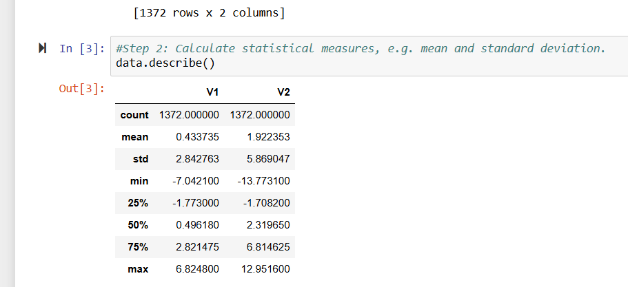
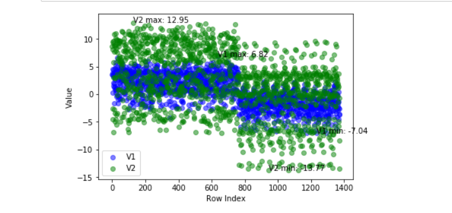
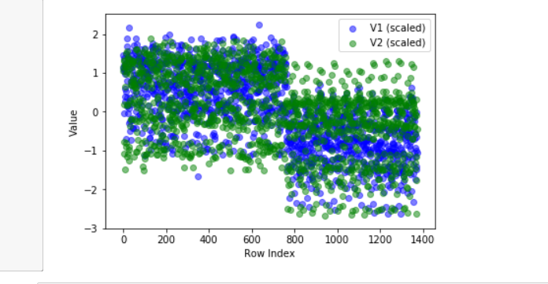
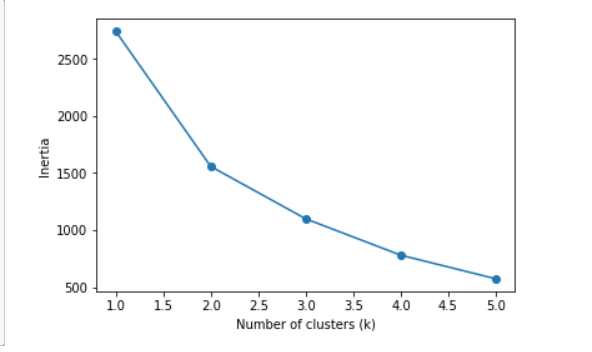

# Banknote Authentication Dataset
**Exploratory Data Analysis**
Evaluating suitability for K-Means clustering

---

> **Overview**
> This dataset contains 1,372 rows and 2 numeric columns, V1 and V2, drawn from the Banknote Authentication dataset. The goal of this analysis is to determine whether the dataset is structurally suited for K-Means clustering, and what preprocessing steps it requires.
> 
## Analysis Question
Is this dataset structurally suited to K-Means clustering, and what preprocessing does it require?

## Methodology
This dataset was provided in the Coursera module titled "Week 4 Code Resource – the Dataset for our Project". The code was ran in jupyterlabs where libraries pandas, matplotlib, and sklearn were used. A tree diagram contained the criteria for determining if a K-means was possible.

The following Five criteria were to determine suitability for K-Means clustering:

- **Numeric variables** — K-Means only works on numbers (distance-based). Categorical variables need encoding or don't belong. V1 and V2 are both numeric.
- **Similar scales** — if one variable ranges 0-1000 and another ranges 0-1, K-Means will basically ignore the smaller one. Checked from the `describe()` output, comparing min/max and std of V1 vs V2.
- **Visible cluster structure** — does the scatter plot show groups, blobs, or separation, or one big spread-out blob with no natural groupings?
- **No extreme outliers** — a few far-flung points can distort where K-Means places cluster centers, since it's averaging distances.
- **Not too many dimensions** — this becomes an issue with many variables (10+), not with just two. Two variables is ideal for K-Means.

## Suitability Framework
This framework guided the evaluation step by step, turning each requirement into a question to check before writing the corresponding code. Additional steps beyond the assignment's requirements were included intentionally, for extra practice with visual plotting and data manipulation.

## Calculating the Statistical Measures
After installing the pandas library the calculations were performed to gain information about the data. We can see here that V2's spread is roughly double V1's, indicating the two variables sit on noticeably different scales. This scale difference requires us to standardize the data before clustering or V2 dominate our outcome. 

📈 Findings & visualizations

To see the difference in the two variable I decided to make them different colors. We can see that  two large blocks that overlap each other. Density is highest near the center of the two blocks and then thins out toward the edges, with no obvious gap splitting the data into visually distinct clusters at this stage.

## Scaled Comparison
After standardization, V1 and V2 are both centered around 0 with matching spread, replacing their previous mismatch in scale. The two variables now occupy the same visual range, confirming the scaling step worked as intended.

## Calculating the Outliers
To ensure there truly were no outliers calculations were performed that proved there were no first and fourth quartiles outliers. Then, another graph was created to calculate the inertia. We can see below it drops sharply from k=1 to k=2, then flattens with only gradual decreases from k=3 onward. This bend at k=2 provides quantitative confirmation of the two-cluster structure first observed in the row-index plot, replacing a visual guess with objective evidence. 

## Conclusions

The 2-cluster split likely reflects the dataset's original purpose — distinguishing genuine from forged banknotes — even though class labels weren't used directly in this analysis. The scale difference between V1 and V2 is likely due to the two variables measuring different properties of the banknote images (e.g., differing units or feature ranges), which is common in real-world feature sets and why standardization is a standard preprocessing step rather than a sign of a data problem.
