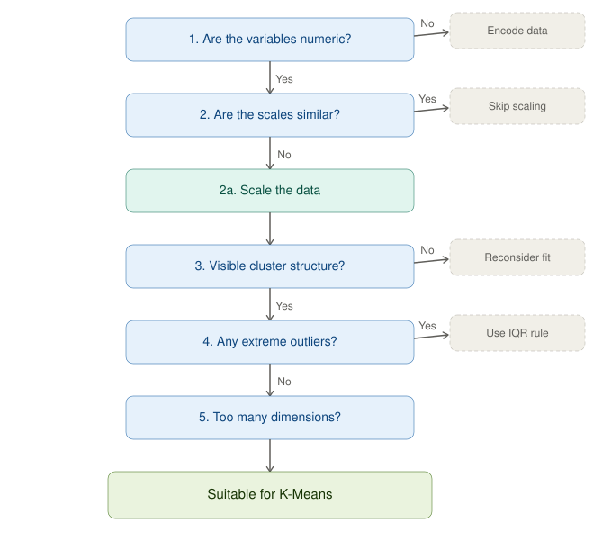

# Banknote Authentication Dataset
**Exploratory Data Analysis**
Evaluating suitability for K-Means clustering

---

> **Key Finding**
> The dataset is suitable for K-Means after standardization. Two natural clusters were confirmed both visually and with the elbow method.

## Analysis Question
Is this dataset structurally suited to K-Means clustering, and what preprocessing does it require?

## Methodology
Five criteria were checked in sequence, using descriptive statistics, visualization, and the elbow method. The criteria used to determine suitability for K-Means clustering were the following:

- **Numeric variables** — K-Means only works on numbers (distance-based). Categorical variables need encoding or don't belong. V1 and V2 are both numeric.
- **Similar scales** — if one variable ranges 0-1000 and another ranges 0-1, K-Means will basically ignore the smaller one. Checked from the `describe()` output, comparing min/max and std of V1 vs V2.
- **Visible cluster structure** — does the scatter plot show groups, blobs, or separation, or one big spread-out blob with no natural groupings?
- **No extreme outliers** — a few far-flung points can distort where K-Means places cluster centers, since it's averaging distances.
- **Not too many dimensions** — this becomes an issue with many variables (10+), not with just two. Two variables is ideal for K-Means.

## Suitability Framework
This framework guided the evaluation step by step, turning each requirement into a question to check before writing the corresponding code. Additional steps beyond the assignment's requirements were included intentionally, for extra practice with visual plotting and data manipulation.

