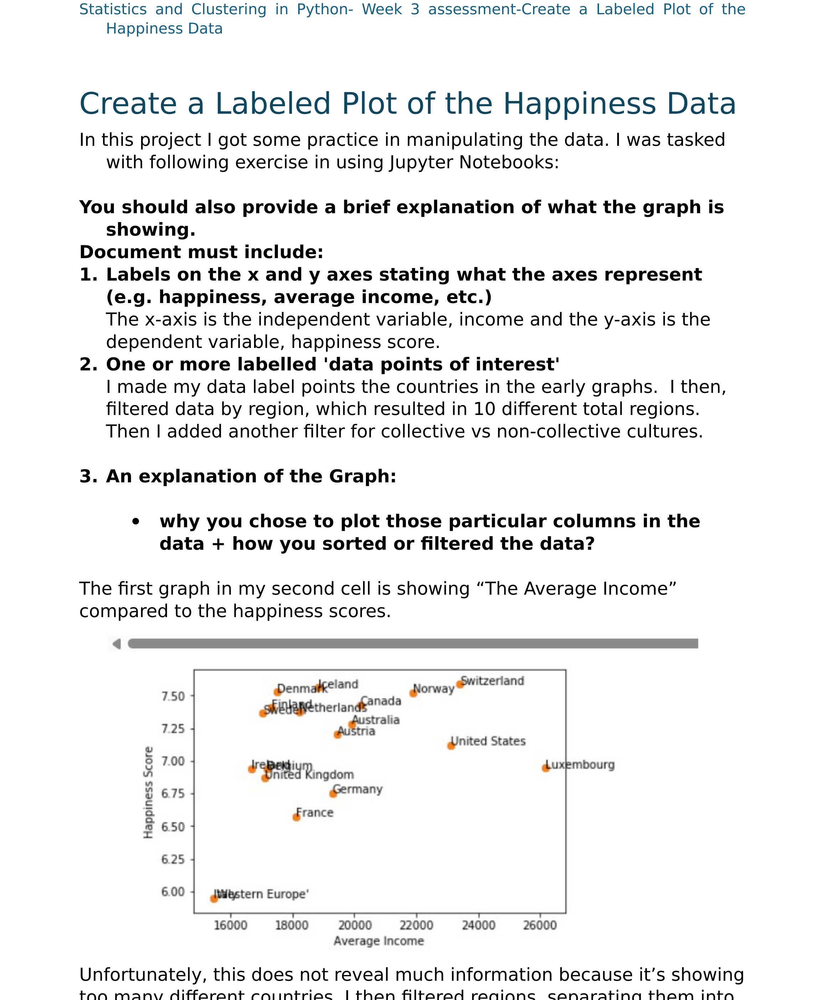
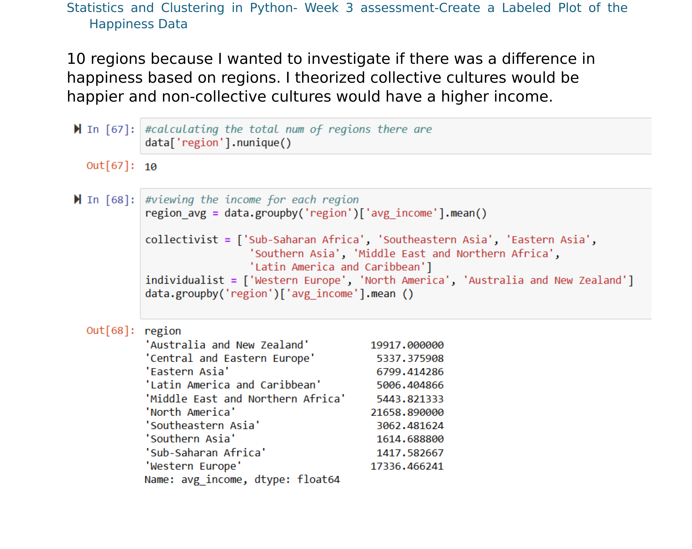
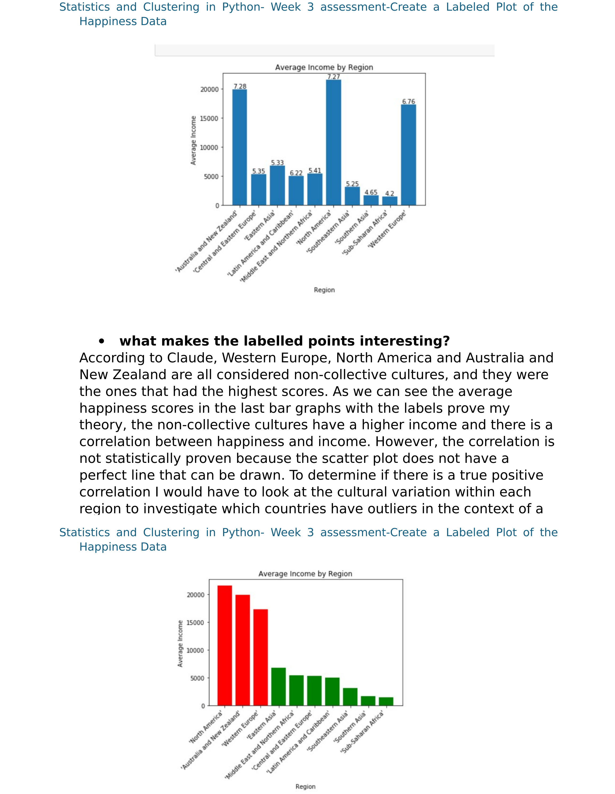

# 😊 Create a Labelled Plot of the Happiness Data
**Course:** Statistics and Clustering in Python — Week 3 Assessment
**Status:** ✅ Complete

---

## 📌 Overview
This project practices data manipulation and labelled visualization in Jupyter Notebooks, using a a csv dataset of country-level happiness scores and average income. This Dataset contain 112 instances. 
## 📁 Dataset
[`happiness_data.csv`](./happiness_data.csv)

## 📊 Project Prompt

---

## 📬 Contact
- **LinkedIn:** *(add your LinkedIn URL here)*
- **Email:** *(add your email here)*
