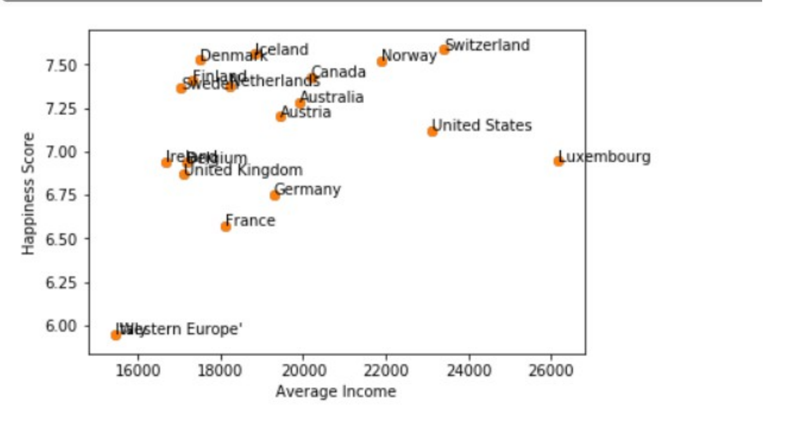
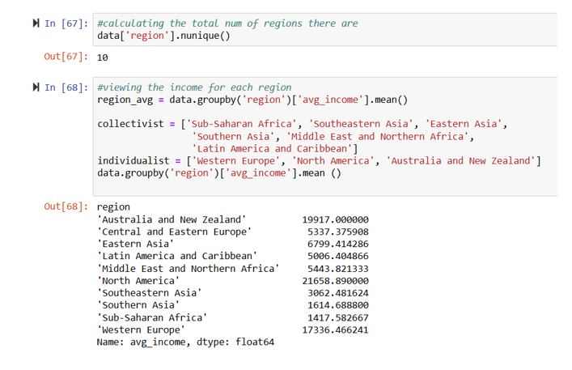
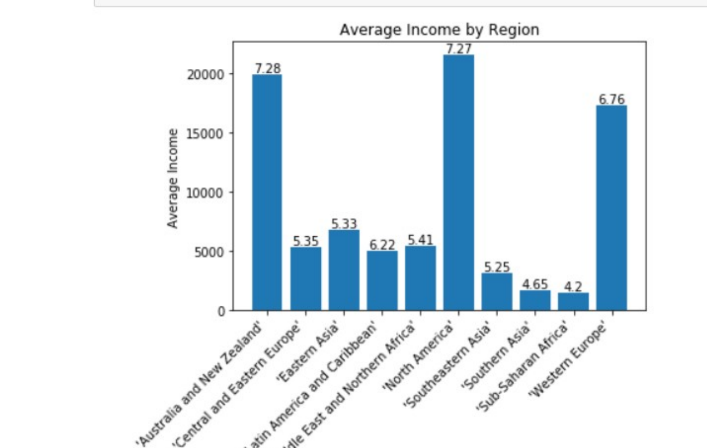
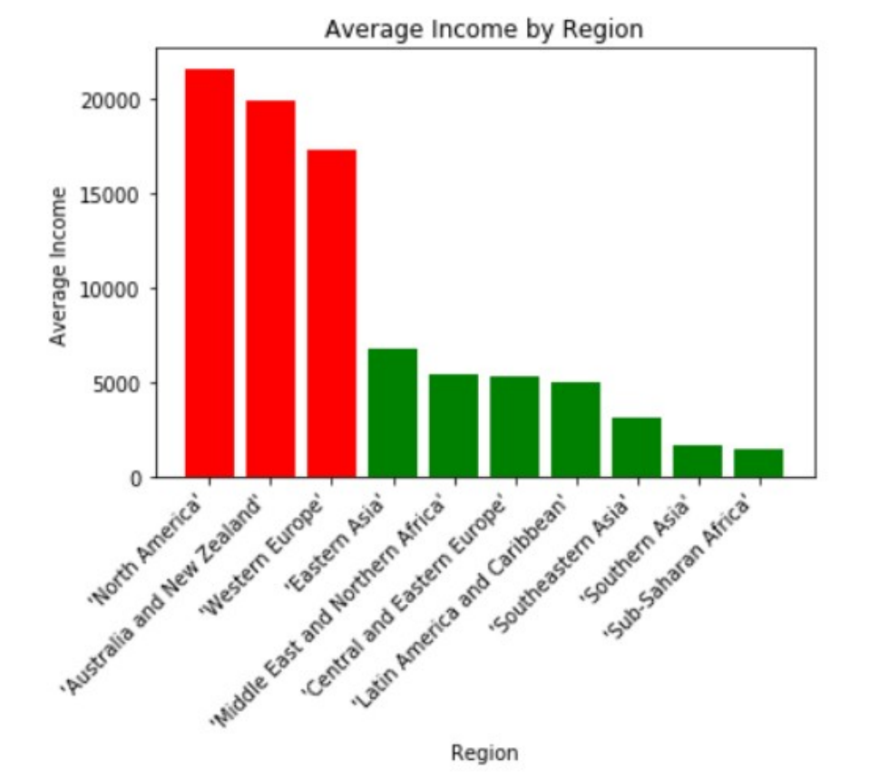

# 😊 Create a Labelled Plot of the Happiness Data
**Course:** Statistics and Clustering in Python — Week 3 Assessment
**Status:** ✅ Complete

---

## 📌 Overview
This project practices data manipulation and labelled visualization in Jupyter Notebooks, using a a csv dataset of country-level happiness scores and average income. This Dataset contain 112 instances. 
## 🟩Dataset 
[`happiness_data.csv`](./happiness_data.csv)

## 📁 jpnb file
[`./Happinessdataset.csv`)](./Happinessdataset.csv)

## 📊 Project Prompt
In this project I got some practice in manipulating the data. I was tasked with following exercise in using Jupyter Notebooks to conduct a cluster analysis.

# You should also provide a brief explanation of what the graph is showing.

The document must include:
1.	Labels on the x and y axes stating what the axes represent (e.g. happiness, average income, etc.)
The x-axis is the independent variable, income and the y-axis is the dependent variable, happiness score.
2.	One or more labelled 'data points of interest'
I made my data label points the countries in the early graphs.  I then, filtered data by region, which resulted in 10 different total regions. Then I added another filter for collective vs non-collective cultures. 
3.	An explanation of the Graph:

•	why you chose to plot those particular columns in the data + how you sorted or filtered the data?

The first graph in my second cell is showing “The Average Income” compared to the happiness scores.

Unfortunately, this does not reveal much information because it’s showing too many different countries. I then filtered regions, separating them into 10 regions because I wanted to investigate if there was a difference in happiness based on regions. I theorized collective cultures would be happier and non-collective cultures would have a higher income. 

Then, I decided to make the data label points for the average happiness scores so we could  view a potential correlation between happiness and income. In the scatterplot we can see there is a positive correlation between income and happiness by looking at the scatterplots.

•	what makes the labelled points interesting?
According to Claude, Western Europe, North America and Australia and New Zealand are all considered non-collective cultures, and they were the ones that had the highest scores. As we can see the average happiness scores in the last bar graphs with the labels prove my theory, the non-collective cultures have a higher income and there is a correlation between happiness and income. However, the correlation is not statistically proven because the scatter plot does not have a perfect line that can be drawn. To determine if there is a true positive correlation I would have to look at the cultural variation within each region to investigate which countries have outliers in the context of a region. 

---

